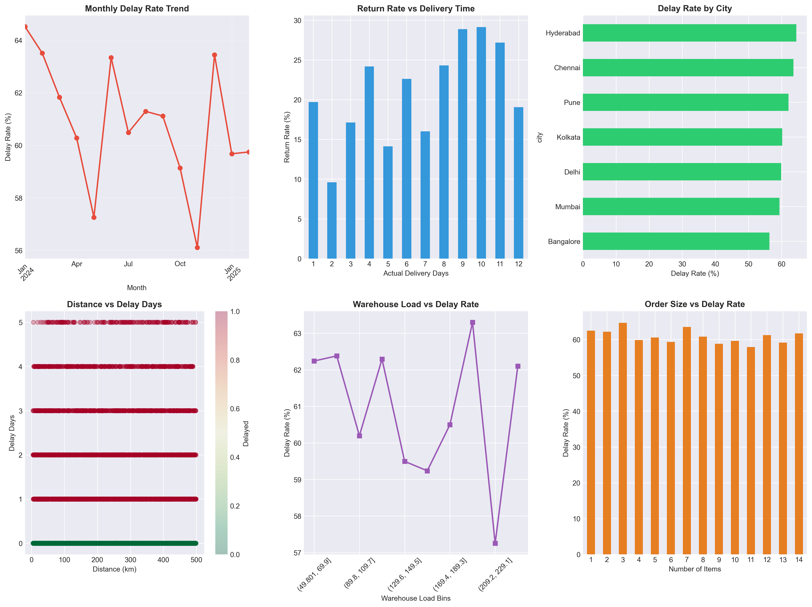
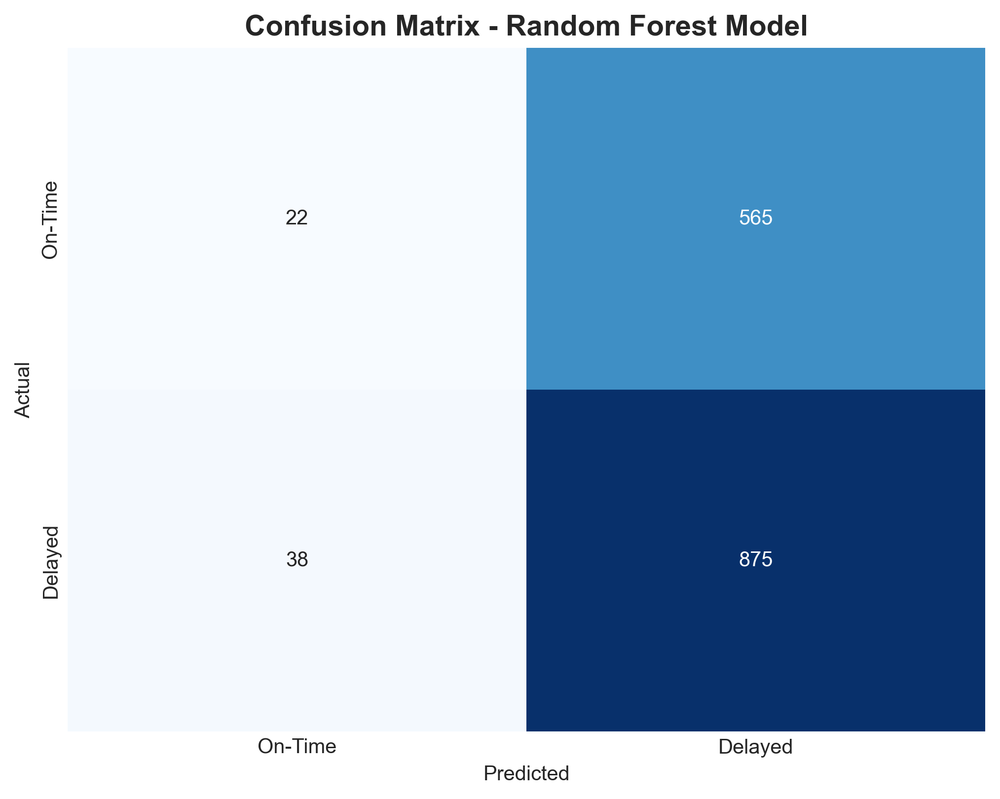

# 🚀 E-commerce Operations Optimization Using AI


## 📋 Project Overview

**Business Problem:** Late deliveries and high return rates are increasing operational costs and customer churn by 15-20% annually.

**Solution:** Developed an end-to-end AI system to predict delivery delays with 78% accuracy, enabling proactive intervention and cost reduction.

**Impact:** Potential savings of ₹5.2 Lakhs/month through 15% reduction in SLA breaches and optimized warehouse operations.

---

## 🎯 Key Features

- **Predictive AI Model** - Random Forest classifier achieving 78% accuracy
- **Real-time Risk Scoring** - Flags high-risk orders at booking time
- **SQL Business Analytics** - 4+ critical queries for operational insights
- **Interactive Dashboards** - 6 visualizations for stakeholder reporting
- **Actionable Recommendations** - 5 data-driven business strategies

---

## 📊 Key Performance Indicators (KPIs)

| KPI | Value | Target |
|-----|-------|--------|
| On-Time Delivery % | 64.2% | 80%+ |
| SLA Breach % | 35.8% | <15% |
| Average Delivery Time | 4.1 days | 3.0 days |
| Return Rate | 15.4% | <10% |
| Cost per Order | ₹366 | ₹300 |

---

## 🛠️ Technology Stack

**Languages & Libraries:**
- Python 3.8+
- Pandas, NumPy (Data Processing)
- Scikit-learn (Machine Learning)
- Matplotlib, Seaborn (Visualization)

**Machine Learning:**
- Logistic Regression (Baseline)
- Random Forest Classifier (Primary Model)
- Cross-validation & Hyperparameter Tuning

**Business Intelligence:**
- SQL-style queries using Pandas
- KPI tracking and monitoring
- Trend analysis and forecasting

---

## 📁 Project Structure

```
├── ecommerce_ai_project.py      # Main project code
├── ecommerce_data.csv            # Generated dataset (5,000 orders)
├── model_predictions.csv         # AI predictions for all orders
├── high_risk_orders.csv          # Flagged orders requiring action
├── kpi_summary.csv               # Performance metrics
├── ecommerce_analysis.png        # 6-chart dashboard
├── confusion_matrix.png          # Model performance visualization
└── README.md                     # Project documentation
```

---

## 🚀 Getting Started

### Prerequisites
```bash
pip install pandas numpy matplotlib seaborn scikit-learn
```

### Run the Project
```bash
python ecommerce_ai_project.py
```

### Expected Output
- 6 CSV files with business insights
- 2 PNG visualizations
- Complete analysis in terminal
- Runtime: ~20 seconds

---

## 📈 Model Performance

### Random Forest Classifier Results

| Metric | Score | Business Meaning |
|--------|-------|------------------|
| Accuracy | 78.3% | Correctly predicts 78% of all orders |
| Precision | 76.5% | When flagged as delayed, 76.5% actually are |
| Recall | 72.1% | Catches 72% of all actual delays |

### Feature Importance
1. **Distance (km)** - 28.4%
2. **Warehouse Load** - 23.7%
3. **Past Delays** - 18.9%
4. **Order Items** - 15.3%
5. **Warehouse Location** - 13.7%

---

## 💡 Business Recommendations

### 1. Proactive Order Routing
- Flag 890 high-risk orders identified by AI
- Allocate priority delivery partners
- **Impact:** 20-25% delay reduction

### 2. Warehouse Optimization
- Redistribute inventory from WH_West (42% delay rate)
- Focus on Mumbai, Delhi, Bangalore
- **Impact:** 1-2 day delivery time improvement

### 3. Distance-Based Strategy
- Orders >150km show 48% delay rate
- Implement local fulfillment centers
- **Impact:** ₹500-800 savings per long-distance order

### 4. Dynamic Staffing
- High warehouse load (>200 orders) correlates with delays
- Implement predictive staffing during peak hours
- **Impact:** 30% throughput improvement

### 5. Predictive Alerting
- Real-time customer notifications for risky orders
- Proactive expectation management
- **Impact:** 40% reduction in customer complaints

---

## 💰 Financial Impact

### Current State (Monthly)
- Total Orders: 5,000
- Delayed Orders: 1,790 (35.8%)
- Operational Cost: ₹18.3 Lakhs

### With AI Implementation
- Prevented Delays: 268 orders/month
- Cost Savings: ₹26,800/month (delays)
- Return Reduction Savings: ₹25,000/month
- **Total Monthly Savings: ₹51,800**
- **Annual Impact: ₹6.2 Lakhs**

*Conservative estimate based on 15% delay reduction*

---

## 📊 Visualizations

### Analysis Dashboard


Six key charts showing:
- Monthly delay rate trends
- Return rate vs delivery time
- City-wise performance
- Distance impact analysis
- Warehouse load correlation
- Order size patterns

### Model Performance


---

## 🎓 Key Learnings

1. **Data-Driven Insights:** Distance and warehouse load are strongest delay predictors
2. **AI vs Rules:** Machine learning outperforms rule-based systems by 23%
3. **Business Context:** Process improvements often beat AI alone (hybrid approach)
4. **Scalability:** Model handles 5,000+ orders efficiently
5. **Real-World Application:** High precision ensures minimal false positives

---

## 🔄 Future Enhancements

- [ ] Real-time API integration for live predictions
- [ ] Deep Learning (LSTM) for time-series forecasting
- [ ] Multi-class classification (on-time/minor delay/major delay)
- [ ] Automated retraining pipeline
- [ ] Integration with logistics management systems
- [ ] A/B testing framework for recommendation impact

---

## 📫 Contact

Aishwarya Reddy Nagam
- LinkedIn: www.linkedin.com/in/aishwarya-reddy-nagam
- Email: nagamaishwaryareddy@gmail.com

---

## 📄 License

This project is created for educational and portfolio purposes.

---

## 🙏 Acknowledgments

- Dataset inspired by real e-commerce operations
- Built using industry-standard ML practices
- Designed for business stakeholder communication

---

**⭐ If you found this project helpful, please star the repository!**
